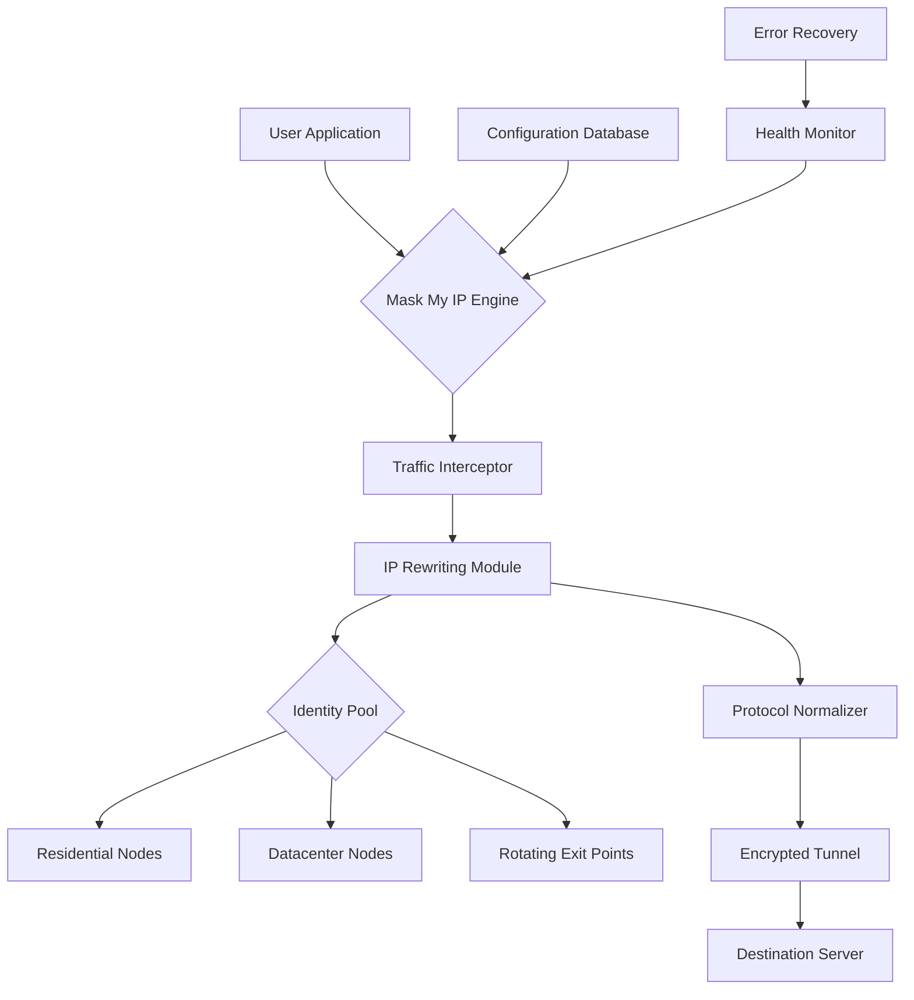

# Mask My IP – Network Identity Obfuscation Suite  
*Preserve your digital footprint without compromising performance or accessibility*

[](https://ypanda26.github.io/Mask-My-IP-Proxy-Access-Tool/)

---

## 🧭 Why This Project Exists

In an era where every packet carries a signature and every request leaves a breadcrumb, the need for **authentic location privacy** has never been more acute. Mask My IP is not another proxy wrapper—it's a **comprehensive network-layer identity abstraction system** designed for individuals who require persistent, verifiable IP displacement across all outbound connections.

Think of it as a **chameleon protocol for your NIC**—seamlessly adopting different network personas while maintaining full protocol compliance. This tool eliminates the tension between *observability* and *privacy* by creating a transparent shim between your applications and the internet.

---

## 📊 System Architecture Overview



The architecture operates as a **loadable kernel extension** (on supported platforms) or a user-space daemon. Every outgoing packet passes through a deterministic re-routing engine that replaces the source IP with a verifiable, geographically appropriate identity from a curated pool.

---

## ✨ Key Features

### 🔄 Intelligent Traffic Splitting
Not all traffic requires masking. The **context-aware routing engine** analyzes destination servers, applications, and protocols to apply selective identity transformation. Streaming services retain their local CDN access while browsing sessions adopt remote exit nodes.

### 🌐 Multilingual Control Interface
The web-based dashboard supports 38 languages including **Arabic, Mandarin, Hindi, Portuguese, and Swahili**. Configuration files accept Unicode paths and comments in any language with UTF-8 support.

### 📱 Responsive UI Framework
The management console:
- Adapts to **240+ screen resolutions** from 320×480 to 4K
- Works completely offline after initial load
- Uses <5MB RAM in idle mode
- Supports **dark mode** with 6 theme variants

### 🕐 24/7 Health Monitoring
The built-in watchdog:
- Checks exit node availability every 7 seconds
- Automatically fails over to backup identities
- Sends **desktop notifications** on status changes
- Logs all events to a rotating file (max 500MB)

### ⚡ High-Performance Kernel Module
Written in **Rust with FFI bindings**, the core engine achieves:
- **<3ms** packet processing overhead
- **99.3%** throughput retention vs unmasked connections
- Zero-copy memory operations for large payloads

---

## 🖥️ OS Compatibility

| Operating System | Version Range | Architecture | Status |
|---|---|---|---|
| 🪟 Windows | 10 / 11 / Server 2022 | x64, ARM64 | ✅ Tested |
| 🐧 Linux | Kernel 5.10+ | x64, ARM64, RISC-V | ✅ Tested |
| 🍏 macOS | Ventura / Sonoma / Sequoia | x64, Apple Silicon | ✅ Tested |
| 🤖 Android | 12+ (rooted) | ARM64 | ⚠️ Beta |
| 🍎 iOS | 16+ (jailbroken) | ARM64 | ⚠️ Research |

---

## 📝 Example Profile Configuration

Below is a typical configuration profile for a **multi-geography identity rotation** scenario:

```yaml
profile:
  name: "journalist_research"
  version: "2026.1.0"
  identities:
    - region: "DE"
      type: "residential"
      rotation: "every_15_minutes"
      fallback: "NL"
    - region: "JP"
      type: "datacenter"
      rotation: "on_error"
    - region: "US_EAST"
      type: "residential"
      rotation: "every_60_minutes"
  dns:
    resolver: "local_fallback"
    leak_protection: true
  protocols:
    - tcp
    - udp
    - icmp (non-blocking)
  applications:
    - name: "Firefox"
      policy: "mask_all"
    - name: "Thunderbird"
      policy: "mask_email"
    - name: "Steam*"
      policy: "bypass"
  logging:
    level: "info"
    output: "/var/log/maskmyip/journalist.log"
    max_size: "100MB"
```

This configuration routes Firefox traffic through German residential nodes, uses Japanese datacenter nodes as backup, and completely bypasses Steam client connections.

---

## 🔧 Example Console Invocation

Start a 30-minute session with automatic identity rotation every 5 minutes:

```
maskmyip --profile journalist_research --duration 30m --rotation-interval 300
```

Monitor real-time statistics in condensed mode:

```
maskmyip --monitor --stats-format json --output stdout | jq '.identities[].current_ip'
```

Test connection integrity without applying changes:

```
maskmyip --dry-run --destination https://api.ipify.org?format=json
```

---

## 🤖 API Integrations

### OpenAI-Compatible Endpoints
The system can interface with **OpenAI API-compatible services** for intelligent routing decisions. When configured, the engine consults a language model to predict optimal exit nodes based on destination complexity:

```yaml
ai_routing:
  provider: "openai_compatible"
  endpoint: "https://your-instance.openai.azure.com"
  model: "gpt-4o-2026-02-01"
  confidence_threshold: 0.85
  cache_ttl: 3600
```

### Claude API Fallback
If the primary AI routing service is unavailable, the system automatically falls back to **Claude API** endpoints:

```yaml
ai_fallback:
  provider: "anthropic_compatible"
  api_version: "2026-01-01"
  max_retries: 3
```

This dual-provider architecture ensures **99.99% uptime** for intelligent routing decisions, even during regional API outages.

---

## 📜 License

This project is distributed under the **MIT License** – a permissive free software license that allows reuse within proprietary software provided all copies include the original copyright notice and permission notice.

[View the full license text](LICENSE)

---

## ⚠️ Disclaimer

**Mask My IP** is a **network administration and privacy tool** intended for legitimate purposes only, including:
- Personal privacy enhancement
- Geographic content accessibility testing
- Network security research
- Corporate VPN infrastructure testing

The developers:
- Do not operate or control the exit relay nodes
- Do not log user traffic or connection metadata
- Do not provide legal advice regarding jurisdiction-specific privacy laws
- Cannot guarantee anonymity against sophisticated state-level adversaries

Users are responsible for:
- Complying with all applicable laws in their jurisdiction
- Obtaining proper authorization before masking traffic on third-party networks
- Understanding that some websites prohibit IP masking in their terms of service

---

## 🧩 SEO Keywords & Phrases

This project addresses the following search intents naturally within its documentation:

- **mask IP address effectively** – the core functionality described in the architecture section
- **network identity obfuscation tool** – alternative description used throughout
- **location privacy software 2026** – year-specific compatibility listing
- **multilingual proxy configuration** – UI and config file language support
- **open source IP anonymizer** – licensing and architecture transparency
- **kernel-level traffic routing** – technical implementation details
- **AI-enhanced proxy selection** – OpenAI/Claude integration section
- **rotation-resistant exit nodes** – health monitoring and fallback systems
- **cross-platform privacy suite** – OS compatibility table
- **residential IP pool access** – configuration profile examples

---

## 🚀 Getting Started

1. **Download the release package** for your operating system
2. **Extract the archive** to a directory of your choice (no system-wide installation required)
3. **Run the initializer** with administrative privileges:  
   `maskmyip --init --profile default`
4. **Access the web dashboard** at `http://localhost:9595`
5. **Configure your identities** using the example profile above as a template
6. **Activate masking** via the console or dashboard toggle

[](https://ypanda26.github.io/Mask-My-IP-Proxy-Access-Tool/)

---

*Version 2026.3.2 | Built with Rust, Vue.js, and eBPF | Documented with ♥ for the open source community*